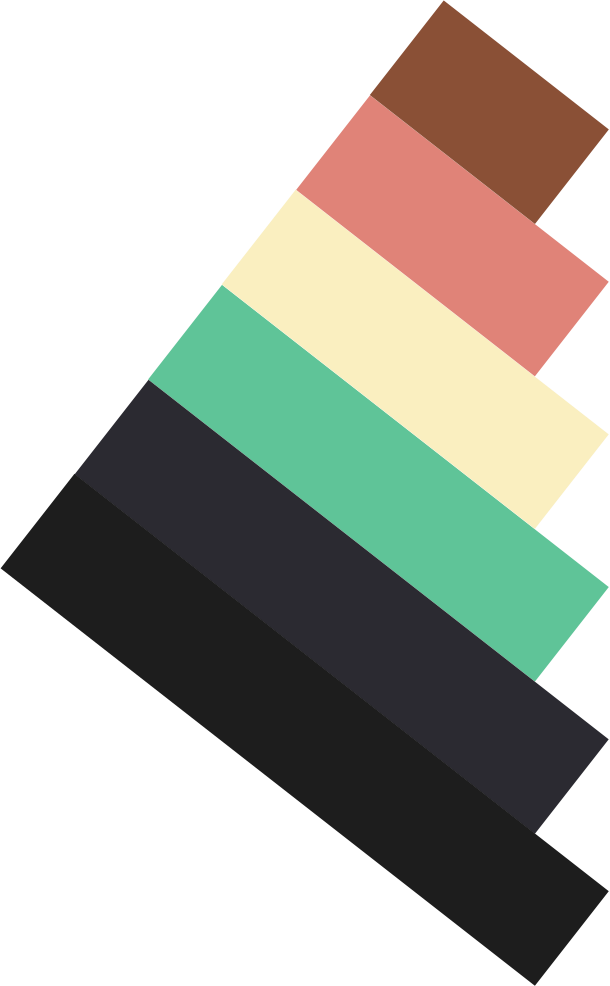

 
#Layar
Sequestered string mapping layer with modular manipulation contexts designed for flixibility and analytical advantages.

##What is Layar

[$TODO]

##Why did we create Layar

###History

Formatting text is tricky. If we store as richtext HTML we alienate our data, removing cross-platform useability in environments that don't render HTML.

A far more modern approach is to store as Markdown which is both lightweight and far more logical to parse. 

###Issues

Whilst Markdown is more advantageous over HTML, it still requires a level of analysis prior to manipulation. To retrieve the second paragraph of a body of text you must either store paragraphs seperately, or apply a markdown-parsing method to get the first and last caret position of the required substring. 

###Concept

Rather than storing text with formatting of any kind, Layar stores simple `JSON` 

> String

"This is a string with some bold text. There are two paragraphs here."

> JSON example

```js
{
  "type": "b",
  "start": 27,
  "end": 37,
  "level": 1
},
{
  "type": "p",
  "start": 37,
  "end": 68,
  "level": 0
},
{
  "type": "p",
  "start": 0,
  "end": 37,
  "level": 0
}
```

> Result

<p>This is a string with some <b>bold text.</b></p><p> There are two paragraphs here.</p>

> Example found [here](http://jsfiddle.net/arthurmingard/srkedupw/6/)

##Roadmap

###Example Functions

> Basic

```js

//Number of paragraphs
layar.get("paragraphs").count()

//Length of first paragraph
layar.get("paragraphs", 0).length()

//Acummulative length of the first 6 paragraphs
layar.get("paragraphs", 0).to(5).length()

//Everything between paragraph 1 and 5
layar.get().from("paragraphs", 0).to(4);

```

> Advanced

```js

//Only paragraph text, without nested formatting, from paragraph 2 to 4
layar.get("paragraphs").from(1).to(3);

//Get all links from the first 3 paragraphs
layar.get("links").from("paragraphs", 0).to(2);

//Get the first quote from each (useful for pullquotes)
layar.get("quotes", 0).from("paragraphs", 0).to();


//All text between the second link and the third bold text
layar.get().from("link", 1).to("bold", 2);

```
